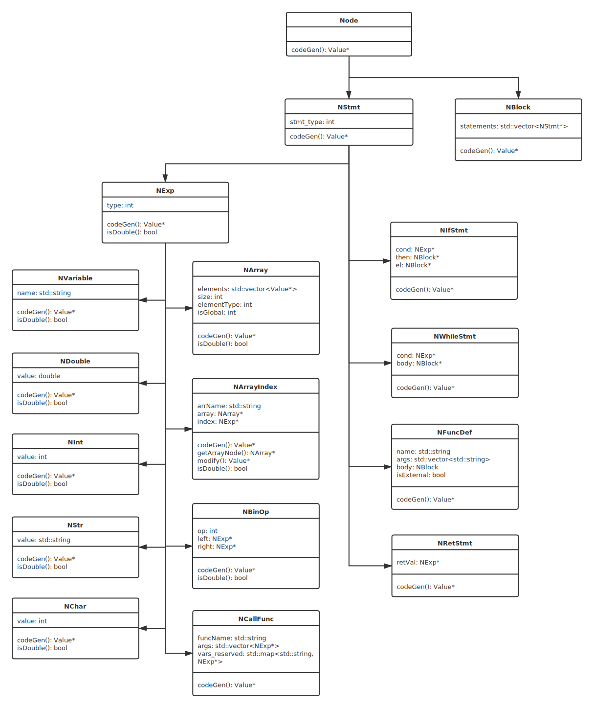

# Documentation

## 1	概述
本项目是基于c++，使用flex, bison, LLVM等工具实现的MyPL编程语言语法编译器，使用flex, bison对源代码进行词法、语法分析；在语法分析阶段生成整个源代码相应的抽象语法树，根据LLVM IR中定义的中间代码语法输出中间代码；最后通过调用LLVM 后端模块的接口，根据本地指令集与操作系统架构，将中间代码编译成二进制目标代码。编译生成的目标代码之后可直接编译生成可执行文件，或与其他目标代码链接生成可执行文件。

## 2	MyPL编程语言
MyPL编程语言混合了python与标准C的部分特征。使用分号`;`作为语句结束的标志。

### 2.1	数据类型

数据类型均使用隐式声明。

1. Number: 包含int, float, bool三种数字类型，bool类型仅在bool表达式中用到
2. Char：用单引号`'`标注
3. String: 用双引号`"`标注
4. List: 声明空间和类型：`arr=(global) type [(int)size]`。`type`可以是`int`、`double`、`char`、`string`（`string`列表存的是字符串指针）。

### 2.2	基本操作

1. 变量赋值：变量赋值不需要类型声明；每个变量在使用前都必须赋值。
   `a = 100`
   `s = "string"`
2. 定义列表：需要类型声明
   `arr = int[10]`
3. 表达式运算：能实现正常的表达式运算

### 2.3	分支和循环结构
支持`if-else`分支语句和`while`循环语句。分支结构的语句块和循环结构的结构体均使用囊括在花括号`{}`中。

*分支语句必须有完整的`if-else`结构。

### 2.4	列表
1. 作为全局变量的列表：`arr = global[(int)size]`，支持在函数中调用和赋值；
2. 作为非全局变量的列表：`arr = [(int)size]`，不支持在函数中调用和赋值。

### 2.5	函数
函数声明：`def function_name(<list of arguments>) { function_body }`

其中`<list of arguments>`是`type name, type name, ...`的形式。

符合语法的函数均通过`return`返回一个值。

## 3	EBNF语法

$ program\rightarrow stmts $

$ stmts\rightarrow stmt\ |\ stmts\ stmt $

$ stmt\rightarrow expr;\ |\ return\ expr\ ;|\ ifstmt\ |\ whilestmt\ |\ funcdef $

$ blk\rightarrow\ \{\ stmts\ \}\ |\ \{\} $

$ funcdef\rightarrow {\rm def}\  \textbf {vairable}\ (\ funcargs\ )\ blk\ |\ {\rm extern}\ {\rm def}\  \textbf {vairable}\ (\ funcargs\ )\ blk $

$ funcargs\rightarrow |\ \textbf {type}\ \textbf {vairable}\ |\ funcargs\ ; \textbf {type}\ \textbf {vairable} $

$ ifstmt\rightarrow {\rm if}\ (\ boolexpr\ )\ blk\ {\rm else}\ blk $

$ whilestmt\rightarrow {\rm while}\ (\ boolexpr\ )\ blk $

$ expr\rightarrow expr\ =\ expr\ |\ expr\ +\ expr\ |\ expr\ -\ expr\ |\ expr\ *\ expr\ |\ expr\ /\ expr $

$\ \ \ \ \ \ \ \ \ \ \ \ \ |\ \textbf{double}\ |\ \textbf{int}\ |\ -\textbf{int}\ |\ \textbf{string}\ |\   \textbf {char}\ |\ \textbf{varaible}\ |\ arraydecl\ |\ arrayindex\ |\ callfunc $

$ boolexpr\rightarrow expr\ \textbf {comparison}\ expr\ |\ boolexpr\ {\rm and}\ boolexpr\ | \ boolexpr\ {\rm or}\ boolexpr $

$ arraydecl\rightarrow {\rm global}\ \textbf {type}\ [\ \textbf{int}\ ]\ |\ \textbf {type}\ [\ \textbf{int}\ ] $

$ arrayindex\rightarrow \textbf{variable}\ [\ expr\ ]  $

$ callfunc\rightarrow \textbf{variable}\ (\ funcvars\ ) $

$ funcvars\rightarrow |\ expr\ |\ funcvars\ ,\ expr $

## 4	抽象语法树UML类图

